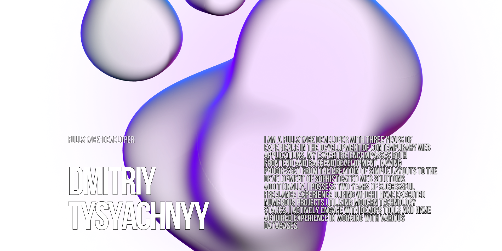

# 👋 Dmitriy Tysyahnyy

### 💻 Tech Stack:

### Frontend

  
	
	
	
	
	
	
	
	
	

---

### Backend

	
	
	
	
  

---

### API

	
	
	

---

### Databases

	
	
  

---

### DevOps

	
	
	

---

### OS Systems

	
	
	
	

---

### 📊 GitHub Statictics

  
  

---

<h3><a href="https://github.com/SkalZOne/My_Works">My works</a></h3>
 
<h3><a href="https://dev.1c-bitrix.ru/learning/resume.php?ID=59638724-8706578">1C-Bitrix Certificates</a></h3>

---

### 📫 Contacts

